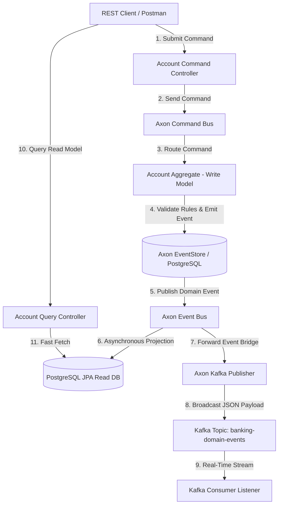

# 🏦 Event-Driven Banking System (CQRS & Event Sourcing with Apache Kafka)

> **An enterprise-grade, distributed banking microservice demonstrating advanced Java architecture, CQRS, Event Sourcing, Saga orchestration, and real-time Kafka streaming.**

---

[](https://www.oracle.com/java/)
[](https://spring.io/projects/spring-boot)
[](https://axoniq.io/)
[](https://kafka.apache.org/)
[](https://www.postgresql.org/)
[](https://www.docker.com/)

---

## 📑 Table of Contents

- [Overview & Business Motivation](#-overview--business-motivation)
- [System Architecture & Flow](#-system-architecture--flow)
- [Core Domain Features & Events](#-core-domain-features--events)
- [Tech Stack](#-tech-stack)
- [Getting Started](#-getting-started)
- [API Reference & cURL Guide](#-api-reference--curl-guide)
- [Event Replay & Schema Upcasting](#-event-replay--schema-upcasting)
- [Automated Testing Strategy](#-automated-testing-strategy)
- [Architecture Decision Record (ADR)](#-architecture-decision-record-adr)

---

## 💡 Overview & Business Motivation

Traditional CRUD-based financial applications suffer from three critical flaws:
1. **Lack of Auditability:** Updating a balance row directly in SQL (`UPDATE account SET balance = ...`) overwrites history, losing exact audit trails.
2. **Concurrency & Race Conditions:** Concurrent deposits and withdrawals on the same row result in dirty reads or database deadlocks.
3. **Scaling Bottlenecks:** High-frequency transaction reads lock transaction write operations.

### How This Solution Solves It:
- **Event Sourcing:** Accounts are stored as an **immutable append-only stream of historical domain events**. Current balance is rehydrated dynamically on-demand.
- **CQRS:** Separates write operations (`AccountAggregate`) from read queries (`AccountEntity` JPA read DB) for zero read/write database contention.
- **Distributed Saga (`TransferSaga`):** Coordinates multi-account money transfers with automated compensating transaction rollbacks.
- **Kafka Backbone:** Streams domain events to external consumer microservices in real-time.

---

## 🏗️ System Architecture & Flow



---

## ⚡ Core Domain Features & Events

The system supports **8+ Domain Events** representing every immutable business event in the banking lifecycle:

| Domain Event | Description | Business Trigger |
| :--- | :--- | :--- |
| `AccountOpenedEvent` | Emitted when a new account is registered. | `OpenAccountCommand` |
| `MoneyDepositedEvent` | Emitted when funds are deposited. | `DepositMoneyCommand` |
| `MoneyWithdrawnEvent` | Emitted when funds are withdrawn. | `WithdrawMoneyCommand` |
| `TransferInitiatedEvent` | Emitted when a fund transfer saga begins. | `TransferMoneyCommand` |
| `TransferCompletedEvent` | Emitted when target account receives funds. | `TransferSaga` Orchestration |
| `TransferFailedEvent` | Emitted when target account deposit fails. | `TransferSaga` Error Handler |
| `CompensationFailedEvent`| Emitted if saga rollback compensation encounters error. | `TransferSaga` Compensation |
| `AccountClosedEvent` | Emitted when account is officially closed. | `CloseAccountAccountCommand` |

> [!IMPORTANT]
> **Business Rule Enforcement:** Account closure is rejected if account balance is greater than $0.00. Closed accounts reject all subsequent deposit or withdrawal commands.

---

## 🛠️ Tech Stack

| Technology | Purpose |
| :--- | :--- |
| **Java 17 / 21** | Modern Java enterprise runtime environment |
| **Spring Boot 3.5.5** | Core framework, dependency injection & REST APIs |
| **Axon Framework 4.11.2** | Event Sourcing engine, Command Gateway, Aggregate management & Saga execution |
| **Apache Kafka 3.9** | External distributed event streaming backbone |
| **PostgreSQL 15** | Relational EventStore & Query read-model persistence |
| **H2 Database** | Fast in-memory database for automated integration testing |
| **Spring Kafka Test / EmbeddedKafka** | In-memory Kafka cluster testing |
| **Testcontainers 1.20** | Containerized integration testing with live Docker instances |
| **Docker & Docker Compose** | Multi-container environment orchestration |

---

## 🚀 Getting Started

### 1. Prerequisites
- **Java 17** or higher installed (`java -version`).
- **Maven 3.8+** (or use the wrapper `.\mvnw.cmd`).
- **Docker Desktop** (optional for running full container stack).

---

### 2. Local Execution (Maven)

```bash
# Clone the repository
git clone https://github.com/YourUsername/event-driven-banking-system.git
cd event-driven-banking-system

# Build and execute all 31 automated tests
.\mvnw.cmd test

# Run the Spring Boot application locally
.\mvnw.cmd spring-boot:run
```

The service will start on **`http://localhost:8080`**.

---

### 3. Docker Compose Orchestration

To run the complete production-like infrastructure (**Spring Boot App + PostgreSQL + Zookeeper + Apache Kafka**):

```bash
docker-compose up --build
```

---

## 📑 API Reference & cURL Guide

Import the included Postman collection [`postman_collection.json`](./postman_collection.json) or use the cURL examples below:

### 1️⃣ Open Bank Account
```bash
curl -X POST http://localhost:8080/accounts/open \
  -H "Content-Type: application/json" \
  -d '{
        "customerName": "Alice Smith",
        "initialBalance": 1000.00
      }'
```
**Sample Response:**
```json
{
  "status": "SUCCESS",
  "accountId": "a1b2c3d4-0000-1111-2222-333344445555",
  "message": "Account created successfully"
}
```

---

### 2️⃣ Deposit Money
```bash
curl -X POST http://localhost:8080/accounts/deposit \
  -H "Content-Type: application/json" \
  -d '{
        "accountId": "a1b2c3d4-0000-1111-2222-333344445555",
        "amount": 250.00
      }'
```

---

### 3️⃣ Initiate Fund Transfer (Saga)
```bash
curl -X POST http://localhost:8080/accounts/transfer \
  -H "Content-Type: application/json" \
  -d '{
        "sourceAccountId": "a1b2c3d4-0000-1111-2222-333344445555",
        "targetAccountId": "b2c3d4e5-9999-8888-7777-666655554444",
        "amount": 150.00
      }'
```

---

### 4️⃣ Fetch Account Details (Read Projection)
```bash
curl -X GET http://localhost:8080/accounts/a1b2c3d4-0000-1111-2222-333344445555
```

---

### 5️⃣ Close Account
```bash
curl -X POST http://localhost:8080/accounts/close \
  -H "Content-Type: application/json" \
  -d '{
        "accountId": "a1b2c3d4-0000-1111-2222-333344445555",
        "reason": "Customer Request"
      }'
```

---

### 6️⃣ Trigger Event Replay
```bash
curl -X POST http://localhost:8080/admin/replay-events
```

---

## 🔄 Event Replay & Schema Upcasting

### Event Schema Evolution (`AccountOpenedEventUpcaster`)
In Event Sourcing, historical events stored in the database are immutable. When payload schemas change over time (e.g. adding a new `currency` field), an **Upcaster** intercepts raw event streams during rehydration and upgrades legacy V1 events to V2 format on-the-fly without corrupting database logs.

### Read Model Event Replay (`POST /admin/replay-events`)
Because the EventStore serves as the ultimate source of truth, read-model query tables can be wiped and completely rebuilt at any time. Calling `POST /admin/replay-events`:
1. Truncates JPA read tables (`AccountEntity`).
2. Resets Axon tracking processor tokens back to **offset 0**.
3. Replays historical event streams from the beginning of time to re-populate read models cleanly.

---

## 🧪 Automated Testing Strategy

The repository maintains **31 Automated Tests** covering unit, saga, Kafka streaming, and container integration:

```bash
.\mvnw.cmd test
```

- **Axon `AggregateTestFixture`:** Tests command handling, event emission, and aggregate state validation without database latency.
- **Embedded Kafka (`@EmbeddedKafka`):** Tests real-time event streaming to Kafka topics in memory.
- **Testcontainers (`@Testcontainers`):** Validates database projections against containerized PostgreSQL instances.

---

## 📄 Architecture Decision Record (ADR)

Detailed technical decisions, trade-offs, and design patterns are documented in [`ADR.md`](./ADR.md).

---

## ⚖️ License

This project is open source and available under the [MIT License](LICENSE).
